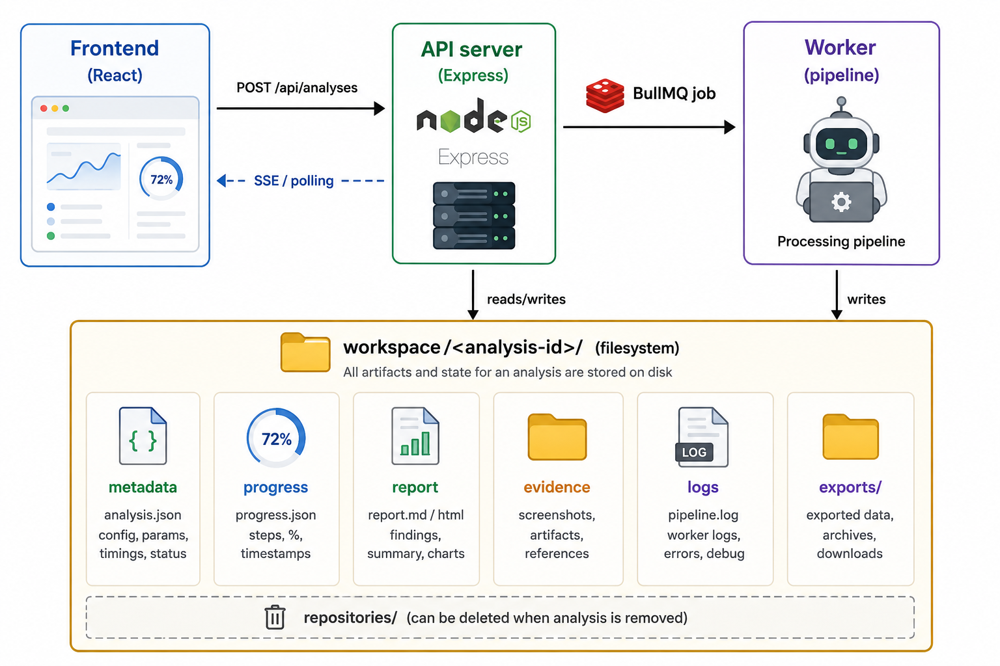

# RepoLens

**Repository:** [github.com/codeWithEdison/repo-lens](https://github.com/codeWithEdison/repo-lens)

**RepoLens is a stateless, open-source repository contribution analyzer.** Paste
one or more repository URLs, and RepoLens clones them into a temporary workspace,
analyzes Git history and project structure, produces an evidence-based technical
contribution report, lets you export it (PDF / JSON / CSV), and then automatically
deletes all temporary data after a configurable retention period.

> RepoLens produces evidence-based technical contribution estimates. It should
> support human discussion and should **not** be treated as an unquestionable
> legal, financial, employment, or equity decision.

There is **no login, no signup, no accounts, no organizations, no billing, and no
permanent database.** Each analysis is temporary and isolated. You can access an
analysis only while you know its analysis id and the temporary workspace still
exists.

---

## Architecture

RepoLens is split into three deployable pieces plus Redis:



- **Filesystem is the source of truth** for progress, report and evidence data.
- **Redis is used only for queue coordination** (BullMQ). No analysis content is
stored in Redis.
- The **API server** validates requests, provisions workspaces, enqueues jobs and
serves progress/report/exports. It never runs analysis inside an HTTP request.
- The **worker** clones and analyzes repositories, updates progress continuously,
writes the report and exports, and **always deletes the cloned repositories**
after processing (success or failure).

### Tech stack


| Layer      | Technology                                                                 |
| ---------- | -------------------------------------------------------------------------- |
| Frontend   | React 19, TypeScript, TanStack Start/Router, Tailwind, shadcn/ui, Recharts |
| API server | Node.js, Express, TypeScript, Zod, BullMQ, ioredis, Helmet                 |
| Worker     | Node.js, TypeScript, BullMQ, simple-git, Octokit, ts-morph, pdfkit         |
| Queue      | Redis + BullMQ                                                             |


---

## Repository structure

```
repo-lens/
├── src/                 # Existing frontend (unchanged design)
│   └── lib/api-client.ts, report-adapter.ts, report-types.ts
├── server/              # Express API (controllers, routes, services, middleware)
├── worker/              # Analysis pipeline (git, analyzers, scoring, reports, exports, cleanup, ai)
├── shared/              # Shared types, constants, schemas, contracts, scoring, workspace, git url
├── workspace/           # Temporary analysis workspaces (gitignored)
├── docker/              # server / worker / frontend Dockerfiles + nginx.conf
├── docker-compose.yml
└── .env.example
```

---

## Local setup

### Prerequisites

- Node.js 22+ (tested on 22/26)
- Redis 7+ (locally or via Docker)
- Git (required by the worker for cloning)

### 1. Clone the repository

```bash
git clone https://github.com/codeWithEdison/repo-lens.git
cd repo-lens
```

### 2. Install dependencies

```bash
npm run install:all
# equivalent to:
#   npm install
#   npm --prefix server install
#   npm --prefix worker install
```

### 3. Configure environment

```bash
cp .env.example .env
```

The server and worker both read `.env`. No AI credentials are required.

### 4. Start Redis

```bash
docker run -p 6379:6379 redis:7-alpine
# or use a locally installed redis-server
```

### 5. Run the three processes (separate terminals)

```bash
npm run dev:server   # API on http://localhost:4000
npm run dev:worker   # background analysis worker
npm run dev          # frontend on http://localhost:5173
```

Open [http://localhost:5173](http://localhost:5173), paste a repository URL, and start an analysis.

---

## Environment variables

See `.env.example` for the full list. Key values:


| Variable                                       | Default                               | Purpose                                              |
| ---------------------------------------------- | ------------------------------------- | ---------------------------------------------------- |
| `SERVER_PORT`                                  | `4000`                                | API server port                                      |
| `FRONTEND_ORIGIN`                              | `http://localhost:5173`               | CORS allowlist (comma-separated)                     |
| `REDIS_HOST` / `REDIS_PORT` / `REDIS_PASSWORD` | `127.0.0.1` / `6379` / –              | Redis connection                                     |
| `WORKSPACE_ROOT`                               | `./workspace`                         | Root for temporary analysis workspaces               |
| `ANALYSIS_RETENTION_HOURS`                     | `24`                                  | How long completed analyses live                     |
| `CLEANUP_INTERVAL_MINUTES`                     | `60`                                  | How often the cleanup scan runs                      |
| `STALE_ANALYSIS_HOURS`                         | `6`                                   | Timeout for stuck / orphaned analyses                |
| `ANALYSIS_WORKER_CONCURRENCY`                  | `2`                                   | Concurrent analyses in the worker                    |
| `MAX_REPOSITORIES_PER_ANALYSIS`                | `5`                                   | Max repos per request                                |
| `MAX_REPOSITORY_SIZE_MB`                       | `500`                                 | Repo size limit                                      |
| `MAX_FILES_PER_REPOSITORY`                     | `50000`                               | Repo file-count limit                                |
| `GIT_CLONE_TIMEOUT_MINUTES`                    | `10`                                  | Clone timeout                                        |
| `GIT_CLONE_DEPTH`                              | `0`                                   | `0` = full history (recommended); `>0` = shallow     |
| `ALLOWED_GIT_HOSTS`                            | `github.com,gitlab.com,bitbucket.org` | SSRF allowlist                                       |
| `ALLOW_PRIVATE_REPOSITORIES`                   | `false`                               | Accept per-repo access tokens to clone private repos |
| `AI_PROVIDER`                                  | `none`                                | `none` or `openai-compatible`                        |
| `AI_BASE_URL` / `AI_API_KEY` / `AI_MODEL`      | –                                     | Optional AI provider                                 |
| `GITHUB_TOKEN`                                 | –                                     | Optional, for GitHub metadata / rate limits          |
| `VITE_API_URL`                                 | `http://localhost:4000`               | Frontend → API base URL                              |


---

## Private repositories

RepoLens can analyze private repositories on GitHub, GitLab, and Bitbucket
using a short-lived access token.

1. Enable the feature on the server: `ALLOW_PRIVATE_REPOSITORIES=true`
  (requests that include a token are rejected with
   `PRIVATE_REPOSITORIES_DISABLED` when this is `false`).
2. In the UI, click **Private** next to the URL field and paste a token
  (optionally a branch), then add the repository. Chips with a token show a
   lock icon.
3. Or call the API directly:

```bash
curl -X POST http://localhost:4000/api/analyses \
  -H "Content-Type: application/json" \
  -d '{"repositories":[{"url":"https://github.com/org/private-repo","accessToken":"<token>"}]}'
```

**Tokens by provider** (create a read-only token with repository read scope):

- GitHub — Personal Access Token. A **classic** token with the `repo` scope is
simplest. A **fine-grained** token must have: resource owner set to the repo
owner/org, this repository in its selected repositories, and **Contents: Read
  - Metadata: Read**. Org repos may require the org to enable/approve
  fine-grained tokens, and SAML SSO orgs require a classic token. Authenticated
  as `oauth2` over HTTPS.
- GitLab — Project/Personal Access Token with `read_repository`. Sent as `oauth2`.
- Bitbucket — App password / access token with repository read. Sent as
`x-token-auth`.

> Note: GitHub returns "not found" (404) — not "unauthorized" — when a token
> cannot see a repository, so a *scoping* problem looks like a missing repo.
> If a valid token fails, re-check the token's resource owner, selected
> repositories, and Contents/Metadata permissions.

Tokens are used **only** to clone the repository for that analysis. They are
authenticated via an HTTP `Authorization` header (never embedded in the stored
remote URL), and are never written to metadata, progress, logs, reports, or
exports.

---

## Docker

```bash
docker compose up --build
```

Starts `frontend` (5173), `server` (4000), `worker`, and `redis`. The server and
worker share a single `workspace` volume; repository clones are never accessible
from the frontend container. `docker/nginx.conf` is provided as an optional
single-origin reverse proxy.

---

## API endpoints


| Method   | Path                               | Description                                      |
| -------- | ---------------------------------- | ------------------------------------------------ |
| `POST`   | `/api/analyses`                    | Create an analysis (returns `analysisId`, `202`) |
| `GET`    | `/api/progress/:analysisId`        | Current progress JSON                            |
| `GET`    | `/api/progress/:analysisId/events` | Server-Sent Events progress stream               |
| `GET`    | `/api/report/:analysisId`          | Report (`202` while generating, `422` if failed) |
| `GET`    | `/api/export/pdf/:analysisId`      | PDF export                                       |
| `GET`    | `/api/export/json/:analysisId`     | JSON export                                      |
| `GET`    | `/api/export/csv/:analysisId`      | CSV export                                       |
| `DELETE` | `/api/analysis/:analysisId`        | Delete workspace (idempotent)                    |
| `GET`    | `/api/health`                      | Health + Redis status                            |


All errors use one shape:

```json
{ "error": { "code": "ANALYSIS_NOT_FOUND", "message": "…", "details": null } }
```

---

## Workspace lifecycle

Each analysis owns an isolated directory:

```
workspace/analysis_8b4fd7c2/
├── metadata.json      # status, repos, timestamps, expiry
├── progress.json      # live progress (never regresses)
├── report.json        # final contribution report
├── evidence.json      # supporting evidence for every conclusion
├── logs.json          # structured stage logs
├── repositories/      # cloned repos — DELETED right after analysis
└── exports/           # report.pdf, report.csv, report.json
```

- All JSON writes are **atomic** (write temp file, then rename) so readers never
see partial data.
- `repositories/` is deleted in a `finally` block whether the analysis succeeds or
fails.
- A scheduled cleanup deletes expired workspaces (default 24h) and stale/orphaned
ones (default 6h).

---

## Security model

Repository content is untrusted input. RepoLens:

- **Never executes repository code** — no `npm/pnpm/yarn/pip/maven/gradle`
installs, no build scripts, no tests, and Git hooks are disabled
(`core.hooksPath=/dev/null`).
- **Prevents SSRF** — only `https`/`http` URLs to an allowlist of hosts
(`github.com`, `gitlab.com`, `bitbucket.org`, plus configured self-hosted
hosts). Rejects `localhost`, private/loopback/link-local IPs, cloud metadata
endpoints, `file://`, and credential-injected URLs.
- **Uses safe Git operations** — argument arrays (no shell concatenation), clone
timeouts, size/file-count limits, `GIT_TERMINAL_PROMPT=0`.
- **Prevents path traversal** — analysis ids are strictly validated; every
filesystem path is resolved and verified to stay inside the workspace root,
including symlink-resolved checks before serving or deleting files.
- **Protects the API** — Helmet, CORS, rate limiting, request-size limits, repo
count/concurrency limits, central error handling, and graceful shutdown.
- **Never persists secrets** — access tokens are passed only through the queue for
cloning and are never written to metadata, progress, report, evidence, logs, or
exports.

---

## Contribution scoring methodology

The score is **not** based only on commits or lines of code — those are treated as
evidence only. Low-signal activity (merge commits, bots, **AI coding assistants**,
lockfile-only, generated files, formatting-only, and reverted changes) is excluded.
Eight normalized, weighted metrics are combined:


| Metric                          | Default weight |
| ------------------------------- | -------------- |
| Feature Ownership               | 30%            |
| Delivery and Completion         | 20%            |
| Technical Complexity            | 15%            |
| Consistency                     | 10%            |
| Quality and Testing             | 10%            |
| Architecture and Infrastructure | 5%             |
| Code Review and Collaboration   | 5%             |
| Maintenance and Stabilization   | 5%             |


Weights are configurable in `worker/src/scoring/weights.ts`. Each metric records
its raw value, normalized value, weight, weighted result, confidence, evidence and
a human-readable explanation. Percentages are normalized to total 100 (unless no
reliable contribution can be calculated). Results are estimates, not absolutes.

### Automated authors and AI coding assistants

Many repositories include commits authored by **automation**, not humans — CI bots
(Dependabot, Renovate, GitHub Actions), and increasingly **AI coding assistants**
that commit under their own Git identity (Lovable, Cursor, Claude, Copilot, Devin,
bolt.new, v0, Codex, and similar tools).

RepoLens treats these as **automated authors**, not separate human contributors:

- Their commits are **excluded from scoring** (same as other bots).
- They do **not** appear in the contribution ranking or equity-style splits.
- Excluded commits are still recorded in evidence with reason
  `AI coding assistant commit` or `Automated bot commit`.

**Recognized AI assistant signals** (by author name or email domain) include:

| Tool / family | Example signals |
| ------------- | --------------- |
| Lovable | `Lovable`, `*@lovable.dev` |
| Cursor | `Cursor`, `Cursor Agent`, `cursoragent@*`, `*@cursor.com` |
| Claude / Claude Code | `Claude`, `*@anthropic.com` |
| Copilot | `Copilot`, `GitHub Copilot` |
| OpenAI Codex | `Codex`, `*@openai.com` |
| Devin | `Devin`, `*@devin.ai`, Cognition domains |
| bolt.new | `bolt`, `*@stackblitz.com` |
| v0, Sweep, Gemini Code | name patterns (`v0`, `Sweep`, `Gemini Code`) |

Patterns live in `worker/src/analyzers/commitClassification.ts`
(`isAiAssistantIdentity`). To add a new tool, extend
`AI_ASSISTANT_NAME_PATTERNS` and/or `AI_ASSISTANT_EMAIL_PATTERNS` there and add a
test in `worker/tests/commitClassification.test.ts`.

**Important limitation:** when an AI tool is the **sole commit author**, Git does
not record which human prompted it — RepoLens can exclude the tool but cannot
reassign that work to a developer. Commits where the human remains author and the
tool appears only in `Co-Authored-By` still credit the human normally. A
developer's own direct commits always count in full.

---

## Current limitations

- Feature detection uses transparent heuristics and may miss or mislabel features.
- Contributor identity merging is conservative and may still be imperfect.
- Commits authored solely by an AI coding assistant are excluded from human
  scores but are not attributed back to the prompting developer (Git metadata
  limitation).
- New or uncommon AI tools may not be recognized until their author/email patterns
  are added to `commitClassification.ts`.
- Pull-request / review signals are only available when GitHub metadata can be
fetched (public repos or with `GITHUB_TOKEN`).
- Deep structural analysis currently covers TypeScript/JavaScript (ts-morph);
other languages fall back to lower-confidence generic analysis.
- Advanced AI analysis is intentionally not enabled by default.

---

## How to add a language analyzer

Deeper structural signals come from `LanguageAnalyzer` implementations
(`worker/src/analyzers/languageAdapter.ts`). To add a language:

1. Implement `LanguageAnalyzer` (`id`, `extensions`, `confidence`, `analyze()`),
  e.g. backed by a tree-sitter grammar (`createTreeSitterAnalyzer` is the
   extension point / stub).
2. Register it in `worker/src/analyzers/structure.ts` via
  `languageRegistry.register(...)`.
3. Unsupported languages degrade gracefully to generic analysis — they never block
  the pipeline.

---

## How to add an AI provider

The app runs fully without AI (`NoopAIProvider` produces deterministic,
template-based, evidence-driven text). To use an OpenAI-compatible endpoint set:

```
AI_PROVIDER=openai-compatible
AI_BASE_URL=https://api.openai.com/v1
AI_API_KEY=sk-...
AI_MODEL=gpt-4o-mini
```

To add a new provider, implement the `AIProvider` interface
(`worker/src/ai/provider.ts`) and wire it into `getAIProvider()`
(`worker/src/ai/index.ts`). Only bounded, structured, secret-free summaries are
ever sent to an external provider — never repository source code.

---

## Testing

```bash
npm run test:all          # server + worker unit and integration tests
npm --prefix server test  # API validation/lifecycle, ids, paths, repo URLs, workspace
npm --prefix worker test  # scoring, classification, contributors, cleanup, full pipeline
```

The worker suite includes an end-to-end test that builds a local Git fixture
repository and runs the full pipeline — no external network or GitHub access is
required.

Type-check everything:

```bash
npm run typecheck:all
```

---

## How to contribute

1. Fork [codeWithEdison/repo-lens](https://github.com/codeWithEdison/repo-lens) and branch from the default branch.
2. Keep the stateless model: no database, no auth, no permanent persistence.
3. Run `npm run typecheck:all` and `npm run test:all` before opening a PR.
4. Keep the existing frontend design intact.
5. Document notable architectural decisions in your PR description.

RepoLens aims to be a community-driven standard for engineering contribution
intelligence. Contributions that improve analyzers, scoring transparency, language
support, and evidence quality are especially welcome.